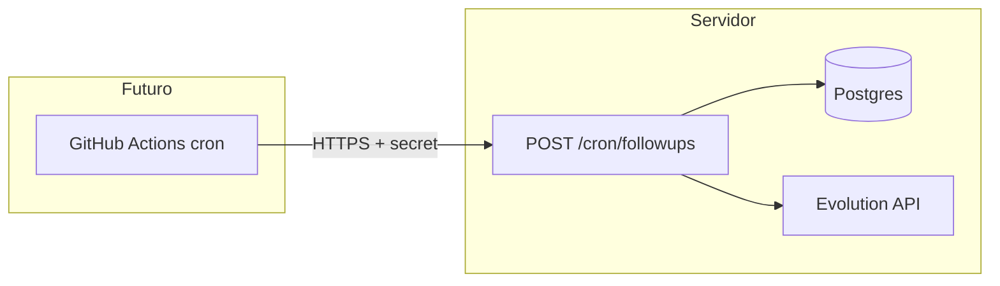

# PJ Codeworks — Agente de vendas (WhatsApp)

Servidor Node.js (Express) que recebe webhooks da Evolution API, mantém conversas e perfis no PostgreSQL (schema `vendas`) e usa Claude para respostas comerciais. O dashboard estático (`dashboard.html`) consome `/dashboard/data` e ações administrativas.

Para novas telas ou ajustes de UI, siga o guia visual em [`docs/GUIA-VISUAL-PJ-CODEWORKS.md`](docs/GUIA-VISUAL-PJ-CODEWORKS.md). A entrada do dashboard é a Central Operacional (`/visao-geral.html`), focada nas filas de ação do operador.

## Cursor + Claude (setup recomendado)

- Leia primeiro [`AGENTS.md`](AGENTS.md) para contexto técnico e fluxo de execução.
- Regras persistentes do agente ficam em `.cursor/rules/claude-max-performance.mdc`.
- Para mudanças em lógica de negócio, rode `npm test` antes de concluir.

O prompt principal (`prompts/system.md`) é carregado junto com **`prompts/empresa.md`** (conhecimento autorizado, ICP híbrido, prova social e URLs permitidos). Catálogo estruturado em `knowledge/cases.json` (referência; o texto injetado no modelo vem de `empresa.md`). Respostas JSON podem incluir opcionalmente **`links_sugeridos`** (URLs validadas pelo servidor antes do envio) e **`mensagens_bolhas`** (array de strings curtas enviadas em sequência no WhatsApp com pequeno atraso). Se não houver bolhas, o servidor pode ainda dividir o texto por parágrafos (`\n\n`) em até quatro envios.

## Prospecção via Google Places

- Defina `GOOGLE_PLACES_API_KEY=...` no `.env` para habilitar a pesquisa em `/prospeccao.html`.
- A chave fica apenas no servidor. O navegador chama `POST /dashboard/prospeccao/places-search`, e o servidor consulta o Google Places API (New).
- A busca usa Text Search com `textQuery`, `maxResultCount`, `languageCode=pt-BR`, `regionCode=BR` e `X-Goog-FieldMask` restrito aos campos usados no painel.
- O endpoint usa a autenticacao do dashboard (cookie httpOnly + CSRF).

### Endpoints do prospectador ativo

- `GET /dashboard/prospeccao/prospects` — lista prospects persistidos com filtros (`status`, `nicho`, `cidade`, `busca`) e diagnóstico mais recente.
- `POST /dashboard/prospeccao/diagnosticos/gerar` — gera diagnóstico unitário (`prospect_id`) ou em lote (`prospect_ids[]`), com fallback heurístico quando `ANTHROPIC_KEY` não estiver configurada.
- `PATCH /dashboard/prospeccao/diagnosticos/:prospect_id` — salva `mensagem_editada`.
- `POST /dashboard/prospeccao/prospects/lote/aprovar` e `POST /dashboard/prospeccao/prospects/lote/rejeitar` — transição de status em lote.
- `POST /dashboard/prospeccao/disparos/enviar` — envia somente prospects aprovados, com idempotência por janela/hashing de mensagem e retry seguro.
- `POST /dashboard/prospeccao/jobs/sync-nichos` — enfileira sincronização de nichos performantes.
- `POST /dashboard/prospeccao/jobs/buscar-automatico` — enfileira busca automática para os melhores nichos/cidades.
- `POST /dashboard/prospeccao/jobs/consumir` — executa jobs pendentes de prospecção.
- `GET /dashboard/prospeccao/metricas` — retorna métricas operacionais (status, enviados, taxa de resposta).

## Follow-up manual (dashboard)

- **POST `/dashboard/followup`** — body JSON `{ "numero": "..." }` (telefone com DDI ou JID `...@s.whatsapp.net`). Opcional: `{ "instrucao": "..." }` para orientar o modelo (não é enviado literalmente ao lead).
  - Se a **última mensagem do histórico for do cliente** (`user`), o servidor usa o **mesmo fluxo do webhook** (`prompts/system.md`, JSON de vendas, cálculo de preço/handoff quando aplicável) — equivalente a **Reenviar resposta**.
  - Se a última mensagem for do **assistente** ou do **operador**, gera uma mensagem curta de reengajamento com `prompts/followup.md` e grava no histórico **sem alterar o estágio** do funil.
- **Autorizacao:** pelo login do dashboard. Chamadas do navegador usam cookie httpOnly e `x-csrf-token`; `REPROCESS_SECRET` fica restrito a integracoes administrativas legadas e `/webhook`.

## Automação de follow-up (implementação futura)

_Não implementado no código atual; referência para evolução com jobs agendados._

### Por que colunas extras depois

O campo `historico` não guarda timestamp por mensagem e `atualizado_em` muda a cada gravação. Para **follow-ups automáticos** (24h / 72h / 7 dias) sem confundir “última mensagem do bot” com silêncio real após vários follow-ups, o desenho previsto é:

| Conceito | Uso |
|----------|-----|
| `silencio_inicio_em` | Timestamp definido só na resposta **normal** do bot ao lead; **não** atualizar em follow-up automático. |
| `followup_nivel` | Inteiro 0…3 conforme envios automáticos no ciclo (ex.: 24h → 1, 72h → 2, 7d → 3). |

### API e agendamento externo

- **`POST /cron/followups`** (futuro) — endpoint protegido por segredo (ex.: `CRON_SECRET` no header ou query), consulta conversas elegíveis, gera/envia mensagens e atualiza níveis/colunas conforme regras.
- **GitHub Actions** — workflow com `schedule` executando `curl` (ou similar) contra a URL pública do servidor, usando secrets como `FOLLOWUP_CRON_URL` e `CRON_SECRET`.

Fluxo conceitual:

Detalhes adicionais podem ser documentados em `docs/` quando o cron for priorizado.
