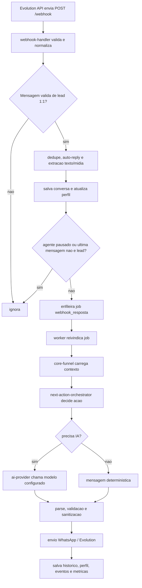

# Como funciona o projeto por etapas

Documento de validacao tecnica e operacional do `pjcodeworks-agent`.

Objetivo: explicar o funcionamento real do sistema em camadas, para facilitar
validacao, diagnostico de gargalos e proposta de melhorias sem quebrar o fluxo
de producao.

Este documento complementa:

- `AGENTS.md`: regras operacionais para agentes.
- `docs/project-map.md`: mapa de pastas e responsabilidades.
- `docs/architecture-rules.md`: limites arquiteturais obrigatorios.
- `README.md`: visao resumida, endpoints principais e setup.

## 1. Visao geral

O projeto e um backend Node.js/Express para atendimento e vendas via WhatsApp.
Ele recebe webhooks da Evolution API, salva conversas e perfis no PostgreSQL,
decide a proxima acao comercial, chama IA quando necessario, valida a resposta
e envia mensagens de volta pelo WhatsApp.

Tambem existe um dashboard estatico em `public/` para operacao comercial,
configuracao, conversas, agenda, custos, analytics e prospeccao.

Os dois schemas centrais do banco sao:

- `vendas`: conversas, perfis, jobs, usuarios do dashboard, logs de IA,
  follow-ups, eventos comerciais e configuracoes operacionais.
- `prospectador`: prospects, diagnosticos, fila diaria, tentativas de envio,
  politicas de contato e metricas de prospeccao.

## 2. Etapa 0 - Boot da aplicacao

Arquivo principal: `index.js`.

Fluxo:

1. Carrega `.env` local quando existe.
2. Define timezone padrao para `America/Sao_Paulo`.
3. Cria o app Express e habilita JSON ate 20 MB.
4. Registra `/health`.
5. Serve arquivos estaticos de `public/`.
6. Registra autenticacao do dashboard.
7. Protege `/dashboard` e `/api/operador`.
8. Registra rotas agregadas por `src/routes.js`.
9. Valida segredos obrigatorios no boot.
10. Carrega prompts e conhecimento.
11. Inicializa o banco com retry.
12. Carrega overlays de prompt vindos do banco.
13. Inicia worker de jobs e silence watcher.
14. Sobe o servidor na porta configurada.

Variaveis obrigatorias validadas no boot:

- ao menos uma chave de IA: `ANTHROPIC_KEY`/`ANTHROPIC_API_KEY` ou
  `OPENAI_KEY`/`OPENAI_API_KEY`;
- `EVOLUTION_API_KEY`;
- `REPROCESS_SECRET`;
- `DASHBOARD_ADMIN_EMAIL`;
- `DASHBOARD_ADMIN_PASSWORD`.

Ponto de validacao:

- se o servidor nao sobe, validar primeiro segredos, conexao Postgres e carga de
  prompts antes de mexer em funil ou IA.

## 3. Etapa 1 - Registro de rotas

Arquivo agregador: `src/routes.js`.

Ele conecta:

- `src/agent.js`: rotas de conversa, dashboard comercial e webhook via modulo
  registrado internamente.
- `src/prospecting.js`: endpoints e jobs de prospeccao.
- `src/agenda.js`: agenda e lembretes.
- `src/ai-routes.js`: configuracao e endpoints de IA.
- `src/whatsapp-routes.js`: operacoes da Evolution/WhatsApp.
- `src/ai-test-routes.js`: testes de IA sem efeitos colaterais.

Ponto tecnico importante:

- `src/routes.js` so agrega. Regra de negocio pesada nao deve ser adicionada ali.

## 4. Etapa 2 - Entrada de mensagem pelo WhatsApp

Arquivo principal: `src/webhook-handler.js`.

Endpoint:

- `POST /webhook`.

Fluxo simplificado:

1. Valida autorizacao do webhook.
2. Responde `{ ok: true }` rapidamente para a Evolution API.
3. Processa somente evento `messages.upsert`.
4. Ignora conversas que nao sao 1:1 com lead.
5. Normaliza o JID/numero.
6. Se a mensagem veio de operador autorizado, processa comando de operador.
7. Se `fromMe`, trata intervencao humana e possivel reuniao fechada pelo
   operador.
8. Aplica idempotencia por chave de mensagem.
9. Extrai texto e midia.
10. Ignora auto-reply do WhatsApp Business antes de salvar historico.
11. Deduplica conteudo repetido em janela curta.
12. Busca ou cria conversa.
13. Identifica se o numero veio de prospeccao.
14. Atualiza historico e perfil do lead.
15. Cancela follow-ups pendentes por resposta real do lead.
16. Registra eventos comerciais relevantes, como pedido de preco.
17. Respeita `agente_pausado`.
18. Verifica se a ultima mensagem real e do lead.
19. Enfileira um job `webhook_resposta`.

Por que isso importa:

- a resposta da IA nao e gerada diretamente dentro do webhook;
- a geracao entra em fila para reduzir duplicidade, permitir debounce e suportar
  retry;
- auto-reply e duplicidade sao tratados antes de qualquer acao comercial.

Pontos de risco:

- mudar dedupe pode gerar respostas duplicadas no WhatsApp;
- mudar reconhecimento de `fromMe` pode confundir operador com lead;
- salvar auto-reply como resposta real pode cancelar follow-ups indevidamente.

## 5. Etapa 3 - Fila e worker de jobs

Arquivos principais:

- `src/agent.js`;
- tabela `vendas.job_queue`.

Tipos relevantes de job:

- `webhook_resposta`;
- `followup_auto`;
- `agenda_lembrete_reuniao`;
- `prospeccao_*`.

Fluxo:

1. `enfileirarJobRespostaWebhook()` cria ou atualiza job com `dedupe_key`.
2. `iniciarJobWorker()` roda um polling por intervalo.
3. `reivindicarProximoJob()` pega o proximo job com `FOR UPDATE SKIP LOCKED`.
4. `processarJob()` roteia pelo tipo.
5. Em sucesso, `concluirJob()` marca como `completed`.
6. Em falha, `falharOuReagendarJob()` aplica retry com backoff.

Ordem de prioridade no worker:

1. resposta de webhook;
2. lembrete de agenda;
3. follow-up automatico;
4. prospeccao.

Ponto de validacao:

- quando o lead respondeu e nada foi enviado, olhar `vendas.job_queue`,
  `ultima_falha_resposta_*` em `vendas.conversas` e logs do worker antes de
  alterar prompt.

## 6. Etapa 4 - Geracao da resposta comercial

Arquivos principais:

- `src/agent.js`;
- `src/core-funnel.js`;
- `src/next-action-orchestrator.js`;
- `src/conversation-pipeline.js`;
- `src/ai-provider.js`;
- `prompts/*.md`.

Fluxo alto nivel:

1. O worker chama `processarRespostaWebhookDebounced()`.
2. A conversa e buscada no banco.
3. Se o agente esta pausado, nao responde.
4. `gerarEEnviarRespostaWhatsapp()` entra no `core-funnel`.
5. O perfil do lead e carregado/canonicalizado.
6. A mensagem atual e o historico alimentam classificadores e extratores.
7. A camada deterministica decide a proxima acao.
8. Dependendo da acao, o sistema pode:
   - responder deterministicamente;
   - consultar agenda;
   - chamar IA para redacao;
   - calcular preco;
   - gerar preview;
   - acionar handoff;
   - registrar lacuna;
   - agendar follow-up.
9. A resposta passa por sanitizacao e validadores.
10. A mensagem e enviada via Evolution API.
11. Historico, perfil, eventos e metricas sao persistidos.

## 7. Etapa 5 - Decisao deterministica de funil

Arquivo principal: `src/next-action-orchestrator.js`.

O orquestrador tenta responder a pergunta: "qual deve ser a proxima acao
comercial?", antes de pedir ao modelo para escrever livremente.

Acoes possiveis incluem:

- `primeiro_contato`;
- `diagnostico`;
- `conexao_valor`;
- `explicar_assinatura`;
- `enviar_link_assinatura`;
- `responder_preco_sem_contexto`;
- `explicar_projeto_sob_medida`;
- `consultar_agenda`;
- `convite_reuniao`;
- `confirmacao_reuniao`;
- `pedir_email`;
- `pedido_humano`;
- `lead_pesquisando`;
- `opt_out`;
- `responder_duvida`;
- `fallback_seguro`.

O que ele observa:

- texto atual do lead;
- historico;
- etapa atual;
- perfil canonico;
- dados extraidos por regex;
- dados extraidos por classificador IA quando disponivel;
- ultima pergunta do assistente;
- sinais de preco, humano, opt-out, assinatura, sob medida e horario.

Guardrails importantes:

- protege contra regressao de etapa em lead avancado;
- evita repetir pergunta basica que ja foi feita;
- separa eco da ultima pergunta do bot;
- impede preco de projeto sob medida sem contexto;
- exige contexto minimo para site antes de avancar para reuniao:
  negocio, cidade e objetivo do site.

Ponto tecnico para melhorias:

- este e um dos melhores lugares para corrigir comportamento de funil. Quando a
  regra e de roteamento, corrigir aqui costuma ser mais duravel que apenas
  alterar prompt.

## 8. Etapa 6 - Core funnel

Arquivo principal: `src/core-funnel.js`.

Responsabilidades:

- transformar a decisao de acao em resultado operacional;
- aplicar mensagens deterministicas quando a regra deve ser travada;
- consultar agenda para horarios;
- permitir IA apenas para tom/redacao em alguns casos;
- validar fatos de reuniao quando a IA reformula texto;
- calcular preco quando o diagnostico esta completo;
- impedir exposicao indevida de preco em projeto sob medida;
- sanitizar texto publico;
- limitar bolhas por etapa;
- enviar mensagens, botoes, links, prints e previews;
- salvar historico;
- registrar eventos;
- acionar handoff;
- registrar lacunas;
- arquivar opt-out;
- agendar follow-up automatico.

Pontos de risco:

- esse modulo combina muitas regras criticas. Mudancas devem ser pequenas,
  testadas e com rollback quando alterarem contrato de funil.
- respostas podem ser enviadas antes de alguns efeitos posteriores. Por isso o
  codigo diferencia erro pos-envio de erro antes do envio.

## 9. Etapa 7 - Prompts e conhecimento

Pastas e arquivos:

- `prompts/system-core.md`;
- `prompts/system-primeiro-contato.md`;
- `prompts/system-diagnostico.md`;
- `prompts/system-proposta.md`;
- `prompts/system-objecao.md`;
- `prompts/system-fechamento.md`;
- `prompts/empresa.md`;
- `prompts/tom-referencia.md`;
- `prompts/classificador-intencao.md`;
- `knowledge/cases.json`.

Como o prompt dinamico e montado:

1. `system-core` define contrato e regras centrais.
2. `empresa.md` injeta conhecimento autorizado.
3. O prompt da etapa atual e anexado.
4. `tom-referencia.md` ancora a cadencia humana.
5. Dados do perfil, memoria, contexto de prospeccao e flags do turno sao
   adicionados.
6. Quando ha pipeline deterministico, o bloco de contexto tambem e anexado.

Regra pratica:

- prompt muda producao diretamente. Alterar prompt deve ter justificativa de
  impacto e teste de regressao quando a regra for comportamental.

## 10. Etapa 8 - Provider de IA

Arquivo principal: `src/ai-provider.js`.

Responsabilidades:

- centralizar chamadas OpenAI e Anthropic;
- ler configuracao em `vendas.ai_settings`;
- usar env como fallback/bootstrap;
- validar provider/model;
- inferir provider a partir do nome do modelo quando necessario;
- aplicar timeout primario e timeout de fallback;
- registrar logs em `vendas.ai_logs`;
- suportar `responseFormatJson` de forma explicita.

Ponto tecnico importante:

- configuracao operacional de provider/model deve vir do banco quando possivel.
  Env e fallback, nao fonte principal para ajustes do dia a dia.

Riscos:

- modelo incompativel com provider gera falha e pode cair em fallback;
- timeout alto demais aumenta fila e latencia;
- timeout baixo demais aumenta falhas aparentes de IA;
- forcar JSON por heuristica de texto e perigoso. O codigo atual exige opt-in
  explicito com `responseFormatJson`.

## 11. Etapa 9 - Banco de dados

Arquivos principais:

- `src/db.js`;
- `src/db-crud.js`;
- `sql/init.sql`.

O banco e inicializado no boot por `initDB()`, com schema SQL e fallback inline.
`src/db.js` tambem cria/migra tabelas do `prospectador`.

Areas principais no schema `vendas`:

- conversas;
- lead profiles;
- job queue;
- webhook dedupe;
- eventos comerciais;
- follow-up automatico;
- agenda/lembretes;
- usuarios/sessoes do dashboard;
- ai settings e ai logs;
- overlays/historico de prompts.

Areas principais no schema `prospectador`:

- prospects;
- diagnosticos;
- eventos de prospect;
- politicas de contato;
- tentativas de envio;
- fila diaria;
- execucoes e relatorios.

Pontos de validacao:

- alteracao de schema deve considerar `sql/init.sql` e fallback/migracoes em
  `src/db.js`;
- verificar compatibilidade com dados existentes;
- manter plano de rollback quando mexer em tabela usada por worker, dashboard ou
  webhook.

## 12. Etapa 10 - Dashboard operacional

Pasta principal: `public/`.

Telas relevantes:

- `visao-geral.html`;
- `conversas.html`;
- `perfil-lead.html`;
- `agenda.html`;
- `prospecacao.html` e `prospeccao.html`;
- `configuracao.html`;
- `custos.html`;
- `analytics.html`;
- `whatsapp.html`.

Arquivos de comportamento:

- `public/dashboard/js/*.js`.

Arquivos de estilo:

- `public/dashboard/css/*.css`.

Regra arquitetural:

- dashboard e apresentacao/operacao. Logica critica, segredos, validacao de
  permissao e decisoes comerciais devem ficar no backend.

Pontos de atencao:

- toda rota sensivel precisa autenticacao;
- toda acao administrativa precisa validacao de entrada;
- nenhum token, chave ou PII sensivel deve ser exposto no frontend;
- estados de loading, vazio e erro precisam existir para telas operacionais.

## 13. Etapa 11 - Prospeccao

Arquivos principais:

- `src/prospecting.js`;
- `src/services/prospecting-settings.js`;
- `src/services/prospecting-eligibility.js`;
- `src/services/prospecting-daily-queue.js`;
- `src/services/prospecting-places-queue.js`;
- `src/services/prospecting-message-generation.js`;
- `src/services/prospecting-send-worker.js`;
- `src/services/prospecting-daily-report.js`;
- `src/services/prospecting-performance-analytics.js`.

Fluxo manual/semi-automatico:

1. Operador busca prospects via dashboard.
2. Backend consulta Google Places quando chave esta configurada.
3. Prospects sao persistidos no schema `prospectador`.
4. Diagnostico e mensagem podem ser gerados por IA.
5. Operador aprova/rejeita ou edita mensagem.
6. Item entra em fila diaria ou disparo.
7. Worker envia pelo WhatsApp com idempotencia.
8. Se o prospect responde, o webhook identifica o contexto de prospeccao e
   injeta isso no perfil/conversa de vendas.

Controles importantes:

- politica de contato;
- opt-out;
- limite diario;
- janela comercial;
- dedupe por prospect, numero e idempotency key;
- status de fila e tentativas de envio.

Ponto tecnico para melhoria:

- prospeccao e conversa ja estao conectadas pelo webhook, mas a qualidade do
  primeiro turno depende muito do contexto salvo em `contexto_prospeccao`.
  Melhorias aqui devem validar a transicao "prospect frio respondeu" antes de
  mexer apenas na mensagem inicial.

## 14. Etapa 12 - Agenda, handoff e operador

Arquivos principais:

- `src/agenda.js`;
- `src/operator-commands.js`;
- `src/operator-meeting-detector.js`;
- `src/handoff-alerts.js`;
- `src/meeting-invite.js`.

Fluxos:

- o funil pode consultar horarios e oferecer reuniao;
- escolha de horario pelo lead gera confirmacao;
- operador pode intervir e pausar o agente;
- mensagem `fromMe` pode ser interpretada como intervencao humana;
- reuniao fechada pelo operador pode ser detectada e registrada;
- handoff notifica operador quando o agente nao deve continuar sozinho.

Pontos de risco:

- nunca confirmar horario que a agenda nao ofereceu;
- nunca inventar disponibilidade;
- quando o operador assume, o agente automatico deve respeitar pausa;
- handoff deve preservar contexto suficiente para o humano agir.

## 15. Etapa 13 - Follow-up e silence watcher

Arquivos principais:

- `src/follow-up.js`;
- `src/followup-auto.js`;
- `src/followup-execution.js`;
- `src/agent.js`.

Comportamento:

- respostas reais do lead cancelam follow-ups pendentes;
- follow-up automatico usa job queue;
- opt-out arquiva conversa para tirar da elegibilidade;
- silence watcher monitora conversas que podem precisar de acao.

Ponto de validacao:

- antes de criar novo follow-up, verificar se a conversa esta arquivada, pausada,
  em handoff, com ultima mensagem do lead ou com job pendente.

## 16. Fluxo completo de uma mensagem recebida

## 17. Como diagnosticar problemas por sintoma

### Lead respondeu, mas o bot nao enviou nada

Verificar:

1. `vendas.conversas.agente_pausado`;
2. ultima mensagem do historico;
3. `vendas.job_queue` para `webhook_resposta`;
4. campos `ultima_falha_resposta_*`;
5. logs do worker;
6. falha de provider em `vendas.ai_logs`;
7. status da Evolution API.

### Bot repetiu pergunta

Verificar:

1. historico completo;
2. `src/next-action-orchestrator.js`;
3. extracao de dados;
4. canonicalizacao do perfil;
5. bloco de coleta injetado no prompt;
6. testes de regressao do funil.

### Bot avancou cedo para reuniao

Verificar:

1. `acao_decidida`;
2. `motivo_decisao`;
3. dados extraidos no turno;
4. perfil persistido;
5. regras de contexto minimo em `next-action-orchestrator`.

> O orquestrador novo + IA-primaria sao sempre ativos no codigo. A flag
> `NEXT_ACTION_ORCHESTRATOR_ENABLED` foi removida — nao ha mais rollback por flag.

### Bot falou preco indevido

Verificar:

1. se rota era assinatura ou projeto sob medida;
2. `diagnosticoCompletoParaPreco()`;
3. `calcularPreco()`;
4. guardrails em `core-funnel`;
5. `action-response-validator`;
6. prompts de proposta;
7. divergencia detectada entre preco IA e motor.

### Prospect frio respondeu estranho

Verificar:

1. match do numero com `prospectador.prospects`;
2. `contexto_prospeccao` salvo no perfil;
3. mensagem inicial enviada;
4. auto-reply;
5. bloco de prospeccao no prompt dinamico;
6. elegibilidade e politica de contato.

## 18. Onde propor melhorias com menor risco

### Melhorias de funil

Preferir:

- `src/next-action-orchestrator.js` para decisao de acao;
- `src/core-funnel.js` para enforcement da acao;
- testes focados em `test/next-action-orchestrator.test.js` ou caso novo em
  `test/`.

Evitar:

- resolver regra de roteamento apenas com prompt.

### Melhorias de tom

Preferir:

- `prompts/tom-referencia.md`;
- montagem do prompt dinamico;
- testes de tom deterministicos.

Evitar:

- mudar varios prompts de etapa ao mesmo tempo.

### Melhorias de IA/configuracao

Preferir:

- `vendas.ai_settings`;
- `src/ai-provider.js`;
- testes de provider/model.

Evitar:

- depender de env para configuracao operacional nao secreta.

### Melhorias de dashboard

Preferir:

- backend validando tudo;
- frontend apenas consumindo estado;
- rotas pequenas e autenticadas.

Evitar:

- regra critica em `public/dashboard/js`.

### Melhorias de banco

Preferir:

- migracao pequena;
- compatibilidade com dados atuais;
- atualizar `sql/init.sql` e `src/db.js` quando ambos forem fonte viva;
- rollback claro.

Evitar:

- alterar tabela de job, conversa ou lead profile sem teste e plano operacional.

## 19. Validacao recomendada por tipo de mudanca

Documentacao:

- revisar arquivos citados;
- nao exige `npm test` se nao houver codigo alterado.

Funil/conversa:

- teste focado de reproducao;
- suites adjacentes;
- `npm test`;
- `npm run typecheck` se tocar `.ts` ou contratos compartilhados.

Preco:

- teste focado;
- `npm run smoke:preco`;
- `npm test`.

Banco:

- validar `sql/init.sql`;
- validar fallback/migracao em `src/db.js`;
- teste de schema quando existir;
- plano de rollback.

Dashboard:

- validar auth;
- validar loading/vazio/erro;
- testar payload invalido;
- garantir que segredo nao vai para frontend.

Prospecao:

- testes de elegibilidade/fila/envio;
- validar idempotencia;
- validar limites diarios e janela comercial.

## 20. Perguntas tecnicas para validar antes de propor solucoes maiores

1. O problema e de decisao de funil, redacao de IA, dados persistidos ou envio?
2. A acao correta deveria ser deterministica?
3. O perfil do lead ja contem os dados que o bot esta perguntando?
4. A informacao veio de conversa normal ou prospeccao?
5. O operador pausou ou interveio?
6. Existe job pendente, falho ou duplicado?
7. O provider/model configurado no banco esta coerente?
8. O prompt ativo veio de arquivo ou overlay no banco?
9. A falha aparece em teste focado?
10. Existe rollback simples para a mudanca proposta?

## 21. Resumo executivo da arquitetura

O projeto funciona como uma esteira:

1. receber mensagem;
2. normalizar e proteger entrada;
3. persistir contexto;
4. enfileirar resposta;
5. decidir acao comercial;
6. gerar texto com IA somente quando necessario;
7. validar/sanitizar;
8. enviar;
9. registrar efeitos;
10. expor operacao no dashboard.

A principal oportunidade tecnica nao e "mais IA", e sim deixar cada vez mais
claro o contrato entre:

- decisao deterministica;
- prompt/geracao;
- validacao antes do envio;
- persistencia;
- observabilidade.

Quanto mais essas fronteiras estiverem explicitas, mais facil sera melhorar o
comportamento comercial sem criar regressao em producao.
