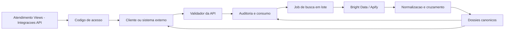

# Especificacao da API de Busca de Leads

> Documento de arquitetura inicial. Nao implementa rotas, banco, workers ou chamadas externas.
> O objetivo e definir como a API deve entregar dados de quatro fontes e sinalizar confiabilidade
> objetiva sem virar motor de score, ICP ou decisao comercial.

## Visao de Produto

A API de busca de leads recebe criterios de mercado, como nicho, cidade, termo, pais ou sementes,
e devolve lotes de leads potenciais com dados canonicos de Google Maps, Instagram, Facebook Pages
e Meta Ads, preservando origem, estado da coleta, bruto auditavel e sinalizacao objetiva de
confiabilidade quando houver batidas claras entre fontes.

O diferencial do Atendimento Views nao e revender payloads da Bright Data ou da Apify. O
diferencial e buscar volume de oportunidades e entregar informacoes organizadas para que o
aplicativo consiga decidir com mais seguranca quando revisar, aplicar ou enriquecer um lead.

Essa mesma camada tambem deve alimentar a tela de Aquisicao do proprio aplicativo. A diferenca e
que a Aquisicao interna usa login do dashboard, empresa atual e permissoes normais do Atendimento
Views; o codigo/API key existe para consumidores externos da API publica.

## Fronteira de Responsabilidade

A API deve ser exata e pouco opinativa.

Ela deve fazer:

- exigir codigo de acesso valido antes de qualquer chamada publica;
- coletar dados nas quatro fontes;
- normalizar campos para um contrato Atendimento Views;
- informar de qual fonte veio cada dado;
- persistir o payload bruto completo no banco do Atendimento Views;
- preservar referencia ao payload bruto em cada dado normalizado;
- separar fonte nao consultada, fonte que respondeu sem resultado e fonte que falhou;
- devolver identificadores externos como `place_id`, `page_id`, `instagram_handle` e URLs;
- sinalizar confiabilidade objetiva quando dados de fontes diferentes batem por identificadores ou
  campos exatos, como telefone, site ou declaracao explicita de perfil.
- auditar cada solicitacao, job, uso de fonte paga, erro e resultado entregue.

Ela nao deve fazer na V1:

- calcular score, ICP, prioridade ou potencial comercial;
- decidir campanhas, abordagem, fila, dono do lead ou aplicacao automatica;
- qualificar lead, validar ICP, priorizar lead ou substituir a logica do aplicativo;
- tratar categoria, nicho, cidade ou nome parecido como confirmacao suficiente;
- esconder dados conflitantes escolhendo um vencedor sem instrucao do aplicativo;
- expor payload bruto como contrato publico;
- chamar Bright Data ou Apify sem job, teto e ledger.
- implementar compra, checkout, cobranca recorrente ou aumento automatico de credito.

## Glossario

- **API de busca de leads:** endpoints que buscam lotes de oportunidades comerciais por mercado e
  devolvem dados padronizados para revisao, enriquecimento ou aplicacao.
- **Uso interno pela Aquisicao:** consumo da mesma camada de busca pela tela de Aquisicao do
  Atendimento Views, autenticado por sessao do dashboard e capacidades da empresa.
- **Uso externo pela API publica:** consumo por sistemas externos usando codigo/API key gerado por
  `superadmin`.
- **Provisao de dados:** camada interna da API que coleta, normaliza e cruza fontes para montar o
  dossie de cada lead potencial.
- **Dossie canonico:** pacote Atendimento Views que agrupa observacoes de uma ou mais fontes.
- **Observacao:** valor retornado por uma fonte, como telefone, site, email, endereco, handle ou
  `page_id`.
- **Procedencia:** metadados que dizem de onde a observacao veio, quando foi coletada e onde esta
  no payload bruto.
- **Payload bruto interno:** resposta completa do fornecedor armazenada no banco do Atendimento
  Views para auditoria, debug, reprocessamento e evolucao futura sem precisar recoletar.
- **Sinalizacao de confiabilidade:** estado objetivo atribuido a um dado quando ele foi declarado
  por uma fonte forte, bateu com outra fonte por campo exato, ficou incerto ou conflitou.
- **Pendencia de verificacao:** item que o aplicativo pode mostrar para uma pessoa revisar quando
  a API nao consegue sinalizar confiabilidade suficiente.
- **Confirmacao humana:** decisao recebida do aplicativo depois que uma pessoa confirma ou rejeita
  uma pendencia.
- **Codigo de acesso / API key:** segredo gerado dentro do Atendimento Views para permitir chamadas
  externas da API de busca de leads.
- **Escopo de acesso:** lista de permissoes daquela chave, como quais fontes pode chamar e se pode
  apenas consultar resultado ou tambem criar jobs.
- **Auditoria de uso:** registro de quem chamou, qual chave foi usada, qual endpoint foi acionado,
  qual job nasceu, quanto retornou, quanto custou e se houve erro.

## Estados de Fonte

Cada fonte deve ter estado operacional:

- `not_checked`: ainda nao consultada.
- `found`: respondeu e trouxe dados.
- `not_found`: respondeu com sucesso, mas nao encontrou resultado.
- `provider_failed`: falhou tecnicamente, ficou indisponivel ou estourou timeout.
- `empty`: respondeu, mas o campo esperado veio vazio.

Regra permanente: `provider_failed` nunca vira `not_found`.

Exemplos:

```json
{
  "source": "google_maps",
  "source_state": "found",
  "records": 23
}
```

```json
{
  "source": "instagram_serp",
  "source_state": "not_found",
  "handles": []
}
```

```json
{
  "source": "meta_ads",
  "source_state": "provider_failed",
  "error_type": "timeout"
}
```

`empty` deve ser usado em nivel de campo quando a entidade existe, mas aquele dado nao veio:

```json
{
  "source": "facebook_page",
  "source_state": "found",
  "email": {
    "value": null,
    "source_state": "empty"
  }
}
```

## Estados de Confiabilidade do Dado

Cada observacao relevante pode carregar `confidence_state`:

- `source_declared`: dado declarado diretamente por uma fonte de origem. Exemplo: telefone do
  Maps, `ig_username` declarado na pagina do anunciante, `page_id` do Facebook.
- `cross_checked`: dado apareceu igual em duas ou mais fontes por campo exato. Exemplo: mesmo
  telefone no Maps e no Instagram; mesmo site no Maps e na bio; mesmo `page_id` no anuncio e na
  pagina.
- `human_confirmed`: o aplicativo enviou confirmacao humana para aquele dado.
- `needs_human_review`: a API encontrou um valor possivel, mas nao ha batida objetiva suficiente.
- `conflict`: fontes diferentes trouxeram valores incompatíveis.
- `unknown`: ainda nao ha informacao suficiente.

Categoria, nicho, cidade e nome podem ser devolvidos como dados, mas nao devem sozinhos gerar
`cross_checked`. Eles ajudam o aplicativo a montar contexto, nao sao confirmacao exata na V1.

Exemplo: se o Maps trouxe telefone e site, e o Instagram trouxe o mesmo telefone ou o mesmo site,
esse campo pode receber `cross_checked`. Se o Instagram apenas parece ter o mesmo nome e a mesma
cidade, deve receber `needs_human_review`, porque ainda depende de criterio humano.

## Contrato Base de Uma Observacao

```json
{
  "value": "5511999990000",
  "source": "google_maps",
  "field": "phone_number",
  "source_state": "found",
  "confidence_state": "source_declared",
  "collected_at": "2026-09-23T19:30:00-03:00",
  "raw_ref": "raw.google_maps[0].phone_number"
}
```

Quando houver mais de uma fonte para o mesmo tipo de dado, a API deve devolver todas:

```json
{
  "phones": [
    {
      "value": "5511999990000",
      "source": "google_maps",
      "field": "phone_number",
      "confidence_state": "cross_checked"
    },
    {
      "value": "5511999990000",
      "source": "instagram_profile",
      "field": "business_phone_number",
      "confidence_state": "cross_checked"
    }
  ]
}
```

Se dois telefones forem diferentes, a API tambem devolve os dois e marca conflito:

```json
{
  "phones": [
    { "value": "5511999990000", "source": "google_maps", "confidence_state": "conflict" },
    { "value": "5511988880000", "source": "facebook_page", "confidence_state": "conflict" }
  ]
}
```

O aplicativo decide qual usar, se pedir revisao ou se manter ambos.

## Dossie Canonico

```json
{
  "dossier_id": "uuid",
  "input": {
    "entry_source": "maps",
    "niche": "energia solar",
    "city": "Goiania - GO",
    "country": "BR"
  },
  "source_status": {
    "google_maps": "found",
    "instagram_serp": "not_checked",
    "instagram_profile": "not_checked",
    "facebook_page": "not_checked",
    "meta_ads": "not_checked"
  },
  "identities": {
    "google_place_ids": [],
    "facebook_page_ids": [],
    "instagram_handles": [],
    "meta_ads_page_ids": []
  },
  "business": {
    "names": [],
    "categories": [],
    "niches": [],
    "locations": []
  },
  "contacts": {
    "phones": [],
    "emails": [],
    "addresses": []
  },
  "web_presence": {
    "sites": [],
    "original_links": [],
    "classified_links": []
  },
  "social": {
    "instagram_profiles": [],
    "facebook_pages": []
  },
  "ads": {
    "meta_ads_pages": [],
    "ads": []
  },
  "verification": {
    "trusted_fields": [],
    "pending_review": [],
    "conflicts": []
  },
  "raw_refs": []
}
```

O dossie pode indicar campos confiaveis, pendentes e conflitantes, mas nao deve decidir sozinho se
deve criar lead, mover carteira ou disparar abordagem.

## Formato Recomendado do Contrato Publico

O contrato publico deve ter tres camadas:

1. `canonical`: dados normalizados do Atendimento Views, estaveis para cliente externo e para a
   tela de Aquisicao.
2. `source_data`: dados ricos por fonte, ainda organizados pelo Atendimento Views, mas sem copiar o
   payload bruto inteiro do fornecedor como contrato publico.
3. `raw_refs`: referencias internas ao payload bruto completo, usado para auditoria,
   reprocessamento, debug e evolucao dos normalizadores.

Resposta recomendada para uma busca em lote:

```json
{
  "job": {
    "job_id": "uuid",
    "status": "completed",
    "entry_source": "maps",
    "requested_limit": 50,
    "returned_count": 47,
    "created_at": "2026-09-23T19:30:00-03:00",
    "completed_at": "2026-09-23T19:34:00-03:00"
  },
  "request": {
    "niche": "energia solar",
    "city": "Goiania - GO",
    "country": "BR",
    "sources": ["google_maps", "instagram_profile", "facebook_page", "meta_ads"]
  },
  "usage": {
    "records_requested": 50,
    "records_returned": 47,
    "provider_calls": {
      "google_maps": 1,
      "instagram_profile": 18,
      "facebook_page": 12,
      "meta_ads": 1
    }
  },
  "dossiers": [
    {
      "dossier_id": "uuid",
      "canonical": {
        "business": {
          "names": [],
          "categories": [],
          "locations": []
        },
        "contacts": {
          "phones": [],
          "emails": [],
          "addresses": []
        },
        "web_presence": {
          "sites": [],
          "instagram_profiles": [],
          "facebook_pages": []
        },
        "ads": {
          "meta_ads_pages": [],
          "active_ads": []
        },
        "verification": {
          "trusted_fields": [],
          "pending_review": [],
          "conflicts": []
        }
      },
      "source_status": {
        "google_maps": "found",
        "instagram_profile": "found",
        "facebook_page": "not_checked",
        "meta_ads": "not_found"
      },
      "source_data": {
        "google_maps": {},
        "instagram_profile": {},
        "facebook_page": {},
        "meta_ads": {}
      },
      "raw_refs": []
    }
  ],
  "next_page": null
}
```

Regra de exposicao:

- o cliente externo recebe `canonical`, `source_status`, `source_data` organizado e `raw_refs`;
- a tela interna de Aquisicao pode receber os mesmos blocos e campos auxiliares para revisao;
- o payload bruto completo do fornecedor fica armazenado no banco do Atendimento Views, mas interno,
  nao como contrato publico principal;
- se no futuro for preciso expor bruto, deve ser por endpoint separado, auditado e restrito, nunca
  como resposta padrao.

## Persistencia do Bruto e Logica do Aplicativo

O Atendimento Views deve armazenar o bruto completo das coletas no proprio banco. O objetivo e nao
perder informacao util dos fornecedores e evitar recoletas quando, no futuro, o aplicativo precisar
de um campo novo, uma nova classificacao ou uma nova forma de revisar leads.

Regras:

- armazenar payload bruto completo por job, fonte e item coletado;
- relacionar cada observacao normalizada a uma referencia do bruto;
- manter `canonical` e `source_data` como contrato de consumo;
- tratar o bruto completo como dado interno, nao como resposta padrao da API publica;
- usar o bruto para auditoria, debug, reprocessamento, novos normalizadores e melhoria da
  Aquisicao.

Separacao de responsabilidades:

- a API busca, normaliza, cruza dados objetivos e preserva evidencia;
- o codigo do aplicativo qualifica, valida, prioriza, decide revisao humana e decide aplicacao no
  Banco de Leads;
- a logica que hoje funciona bem por cliente deve migrar para services/regras do aplicativo, nao
  para o contrato publico da API.

## Uso Principal: Busca de Leads em Volume

As APIs publicas devem nascer como ferramenta de busca de leads em volume, nao para investigar uma
pessoa ou negocio isolado.

Uso esperado:

- buscar negocios por nicho e cidade no Maps;
- buscar anunciantes por nicho, termo, cidade ou pais no Meta Ads;
- buscar perfis por nicho, termo, cidade ou lista de sementes no Instagram;
- buscar paginas a partir de um lote de URLs ou paginas descobertas em outra fonte.

O lookup um-a-um existe apenas como etapa interna de enriquecimento ou verificacao de um lote ja
coletado. Exemplo: a busca Meta Ads devolve 25 paginas; depois a API pode consultar Facebook Page
uma a uma para completar telefone, email, site e endereco. Esse passo nao e o produto principal,
e sim uma fase interna do pipeline de enriquecimento da busca de leads.

Consequencia para o contrato:

- toda chamada publica deve criar job assincrono por padrao;
- toda resposta deve aceitar varios itens/dossies;
- custo e ledger devem ser calculados por lote;
- verificacoes um-a-um devem ficar ligadas ao job de origem;
- nao criar endpoint publico pensado para "investigar esta pessoa unica" na V1.

## Modelo de Jobs Assincronos

Toda busca deve ser tratada como um job. A chamada inicial nao deve tentar resolver todas as
fontes antes de responder. Ela deve validar acesso, registrar auditoria, criar o job e devolver
rapidamente um `job_id`.

Fluxo recomendado:

1. cliente externo ou Aquisicao interna solicita uma busca em lote;
2. API valida acesso, escopo, limite e orcamento;
3. API cria `lead_search_job`;
4. resposta imediata devolve `job_id` e status inicial;
5. worker processa as fontes em segundo plano;
6. cada fonte atualiza seu proprio estado;
7. dossies ficam disponiveis conforme sao montados;
8. cliente/tela consulta status e resultados pelo `job_id`.

Resposta da criacao:

```json
{
  "job": {
    "job_id": "uuid",
    "status": "queued",
    "entry_source": "maps",
    "requested_limit": 50,
    "created_at": "2026-09-23T19:30:00-03:00"
  }
}
```

Estados do job:

- `queued`: criado e aguardando execucao.
- `running`: alguma fonte esta em processamento.
- `partial_completed`: terminou com pelo menos uma fonte util e pelo menos uma falha ou pendencia
  operacional.
- `completed`: terminou com sucesso operacional.
- `failed`: nenhuma fonte util foi concluida.
- `cancelled`: cancelado antes do fim.
- `expired`: resultado antigo demais para continuar sendo consultado como ativo.

Estados por fonte continuam separados dos estados do job. Exemplo: um job pode ficar
`partial_completed` com `google_maps=found`, `instagram_profile=found` e `meta_ads=provider_failed`.
Isso evita transformar falha de fornecedor em fracasso total da busca.

Endpoints minimos do modelo:

```http
POST /api/lead-search/maps
GET  /api/lead-search/jobs/:jobId
GET  /api/lead-search/jobs/:jobId/dossiers
```

Na Aquisicao interna, a tela deve usar o mesmo conceito: criar job, mostrar progresso por fonte,
listar dossies prontos e permitir revisao/aplicacao quando o aplicativo decidir.

## Acesso, Codigos e Auditoria

A API publica deve ser protegida por codigo de acesso gerado dentro do Atendimento Views. Esse
codigo funciona como uma API key: sem codigo valido, a chamada deve parar antes de criar job ou
consultar qualquer fornecedor pago.

Esse codigo protege somente o uso externo. A tela interna de Aquisicao pode chamar o mesmo motor de
jobs, normalizadores, cruzamento e dossies usando a autenticacao normal do dashboard e a capacidade
de aquisicao da empresa. Assim o aplicativo reaproveita a API de busca sem entregar codigos
externos para operadores internos.

Na V1, a compra fica fora do escopo. O modelo operacional inicial e:

1. um `superadmin` do Atendimento Views cria um codigo de acesso;
2. define nome interno, empresa/dono operacional, validade, escopos e limites;
3. entrega o codigo ao cliente ou sistema externo;
4. o cliente chama a API usando esse codigo;
5. cada chamada gera auditoria e consumo;
6. quando expira ou e revogado, o codigo nao cria novos jobs.

Fluxo recomendado:



### Campos do codigo de acesso

Campos minimos:

- `api_key_id`: identificador interno da chave.
- `empresa_id`: empresa dona daquela chave.
- `nome`: rotulo visivel, como "Cliente Solar - setembro".
- `key_hash`: hash do codigo, nunca o codigo em claro.
- `key_hint`: ultimos caracteres para identificacao na tela.
- `status`: `active`, `expired`, `revoked`.
- `expires_at`: data e hora de expiracao.
- `revoked_at`: data e hora da revogacao, quando houver.
- `created_by`: usuario do Atendimento Views que criou a chave.
- `created_at`.
- `last_used_at`.
- `scopes`: permissoes da chave.
- `quota_total`: limite contratado/manual do periodo.
- `quota_used`: consumo ja registrado.
- `rate_limit`: teto tecnico por minuto/hora.

O codigo em claro deve aparecer uma unica vez, no momento da criacao. Depois disso, a tela mostra
apenas `key_hint`, status, validade, consumo e acoes administrativas.

### Limites e Quotas da V1

Limites iniciais definidos:

- `max_leads_per_job`: 100 leads por busca.
- `source_limits`: sem limite especifico por fonte na V1.
- `external_monthly_dossier_quota`: sem cota mensal na V1.
- `rate_limit`: protecao tecnica contra rajada de chamadas, nao regra comercial.

Como interpretar:

- se uma chamada pedir `limit` maior que 100, a API deve recusar ou normalizar para 100, conforme
  decisao de implementacao;
- nao existe cota mensal por codigo externo nesta fase;
- a tela interna de Aquisicao tambem respeita 100 leads por busca;
- o `rate_limit` serve para impedir abuso tecnico, como muitas requisicoes seguidas em poucos
  segundos. Ele nao substitui cota comercial, porque essa cota ainda nao existe na V1.

Numero sugerido para `rate_limit` na V1: ate 10 criacoes de job por minuto por codigo externo.
Esse valor pode mudar sem alterar o contrato de produto, porque e uma protecao operacional.

### Modelo de dados inicial

Tabelas conceituais para a implementacao:

- `app.lead_search_api_keys`: chaves geradas, hash, hint, dono, status, validade, escopos e
  limites.
- `app.lead_search_usage_events`: auditoria de cada tentativa de uso, aceita ou negada.
- `app.lead_search_jobs`: jobs em lote criados por chamadas validas.
- `app.lead_search_job_sources`: estado de cada fonte dentro do job, com custo e erro tecnico.
- `app.lead_search_dossiers`: dossies canonicos resultantes.
- `app.lead_search_raw_refs`: referencias controladas para payload bruto interno.
- `app.lead_search_app_decisions`: confirmacoes ou rejeicoes humanas vindas do aplicativo.

### Escopos iniciais

Escopos sugeridos:

- `lead_search:maps:create`
- `lead_search:instagram:create`
- `lead_search:facebook_page:create`
- `lead_search:meta_ads:create`
- `lead_search:jobs:read`
- `lead_search:dossiers:read`

`lead_search:dossiers:apply` deve ficar separado e, por padrao, desabilitado para chaves externas,
porque aplicar no Banco de Leads muda dado operacional do Atendimento Views.

### Validacao de cada chamada

Toda chamada publica deve seguir esta ordem:

1. ler o codigo no header, por exemplo `Authorization: Bearer <codigo>`;
2. calcular hash e localizar chave ativa;
3. validar `empresa_id`, status e expiracao;
4. validar escopo exigido pelo endpoint;
5. validar quota e rate limit;
6. registrar tentativa de uso;
7. so entao criar job e chamar Bright Data, Apify ou outro fornecedor.

Se qualquer validacao falhar, a resposta deve ser `401` ou `403`, e nenhuma chamada paga deve
acontecer.

### Auditoria por chamada

Cada chamada deve gerar um evento auditavel. A auditoria deve permitir responder:

- quem gerou a chave;
- qual empresa ou cliente usou;
- qual endpoint foi chamado;
- quais parametros principais foram pedidos, sem salvar segredo ou payload sensivel em claro;
- qual job foi criado;
- quais fontes foram consultadas;
- quantos registros foram solicitados e quantos foram entregues;
- qual foi o estado final: `accepted`, `completed`, `failed`, `blocked`, `expired_key`,
  `quota_exceeded`, `provider_failed`;
- qual custo estimado/real foi consumido por fornecedor;
- quando comecou, terminou e qual erro ocorreu, se houver.

Auditoria nao deve guardar codigo de acesso em claro, token de fornecedor, payload bruto completo
ou dado sensivel desnecessario. Payload bruto fica referenciado no armazenamento interno do job,
com controle proprio.

### Tela futura em Integracoes

No aplicativo, a tela futura pode ficar em `Integracoes -> API`.

Acoes esperadas:

- criar codigo;
- escolher validade;
- escolher escopos;
- definir limite de uso;
- ver chaves ativas, expiradas e revogadas;
- copiar codigo apenas no momento da criacao;
- revogar chave;
- rotacionar chave;
- ver ultima utilizacao;
- ver consumo por periodo, endpoint e fonte.

Essa area deve ser visivel apenas para `superadmin` da plataforma. `owner` e `admin` da empresa
continuam podendo acessar integracoes normais conforme suas capacidades, mas nao devem criar,
revogar ou rotacionar codigos da API publica de busca de leads.

Criar, revogar e rotacionar chaves deve exigir autenticacao normal do dashboard e papel global
`superadmin`. Se a chave for associada a uma empresa para organizacao, consumo ou relatorio, essa
associacao e metadado do codigo, nao uma permissao para o admin da empresa gerenciar a chave. A
API externa usa codigo de acesso; a tela de gestao usa login do Atendimento Views. Sao duas
camadas diferentes.

Resumo da separacao:

- `superadmin`: gerencia codigos/API keys da API publica.
- Aquisicao interna: consome o motor de busca com login do dashboard e permissao de aquisicao.
- API publica externa: consome o motor de busca com codigo/API key valido.
- Aplicativo: trata os dados, revisoes, aplicacao no Banco de Leads e regras comerciais.

## Quatro APIs de Entrada

### 1. Google Maps via Bright Data Maps

Entrada primaria:

```json
{
  "niche": "energia solar",
  "city": "Goiania - GO",
  "country": "BR",
  "limit": 50
}
```

Dados que a API deve devolver quando existirem:

- `place_id` ou `cid`;
- `name`;
- `address`;
- `phone_number`;
- `open_website`;
- `url`;
- `rating`;
- `reviews_count`;
- `category`;
- `all_categories`;
- `photos_and_videos`;
- `open_hours`;
- `permanently_closed`;
- `temporarily_closed`;
- payload bruto referenciado.

Se `open_website` for Instagram, site proprio ou agregador, a API deve devolver a URL classificada
como dado. A decisao de valor comercial fica para o aplicativo.

### 2. Instagram via Bright Data SERP e Profiles

Entradas possiveis para volume:

```json
{
  "niche": "energia solar",
  "city": "Goiania - GO",
  "limit": 50
}
```

```json
{
  "seed_handles": ["abcsolar", "solarprime"],
  "snowball": true,
  "limit": 50
}
```

Dados que a API deve devolver quando existirem:

- handle;
- URL do perfil;
- titulo e resumo da SERP;
- `full_name`, `name`, `account`, `user_name`;
- `biography`, `bio`, `about`, `description`, `headline`;
- `external_url`, `bio_link`, `website`, `link_in_bio`, `url_in_bio`;
- emails declarados;
- telefones declarados;
- seguidores;
- categoria do perfil;
- relacionados;
- posts e datas quando vierem no perfil;
- payload bruto referenciado.

Se o telefone ou site do Instagram bater com outra fonte do dossie, a API pode marcar esse campo
como `cross_checked`. Se houver apenas nome/cidade parecidos, deve manter como dado pendente para
o aplicativo revisar.

### 3. Facebook Pages via Bright Data `fb_paginas`

Entrada primaria por lote:

```json
{
  "facebook_page_urls": [
    "https://www.facebook.com/empresa-a",
    "https://www.facebook.com/empresa-b"
  ]
}
```

Dados que a API deve devolver quando existirem:

- `page_transparency.page_id`;
- `page_name`;
- websites;
- telefones;
- emails;
- endereco formatado;
- seguidores;
- `page_transparency.is_running_ads`;
- Instagram declarado, se vier no dataset;
- payload bruto referenciado.

Se a pagina confirmar o mesmo `page_id` vindo do Meta Ads, a API pode marcar a identidade como
`cross_checked`. Se apenas o nome da pagina parecer com o nome do Maps, deve ficar pendente para o
aplicativo.

### 4. Meta Ads via Apify Facebook Ads

Entrada primaria:

```json
{
  "niche": "energia solar",
  "search_term": "energia solar goiania",
  "city": "Goiania - GO",
  "country": "BR",
  "limit": 25
}
```

Dados que a API deve devolver quando existirem:

- `pageId` ou `pageID`;
- `snapshot.pageName`;
- `snapshot.pageCategories`;
- `page_info.page_category`;
- `isActive`;
- `startDate`;
- `snapshot.linkUrl`;
- `adArchiveID`;
- `page_profile_uri`;
- `ig_username`;
- `pageLikeCount`;
- `publisherPlatform`;
- `about.text`;
- payload bruto referenciado.

Se `ig_username` vier declarado pelo anunciante, a API pode devolver esse Instagram como
`source_declared`. Se esse mesmo handle tambem aparecer no Instagram Profile ou em outra fonte,
pode virar `cross_checked`.

## Como as APIs Conversam

"Conversar" significa usar o resultado de uma fonte para chamar outra e devolver dados lado a lado
com estados de confiabilidade.

### Maps -> Instagram

1. Maps retorna nome, cidade, telefone, site e possivel link de Instagram.
2. Se houver handle ou URL de Instagram, a API pode chamar Instagram Profile.
3. Se nao houver, o aplicativo ou a API, conforme estrategia do job, pode chamar SERP por
   nome+cidade.
4. Se telefone ou site bater, os campos recebem `cross_checked`.
5. Se houver apenas nome/cidade, a API devolve `needs_human_review` para o Instagram candidato.

### Instagram -> Maps

1. Instagram retorna bio, telefone, email e link da bio.
2. A API pode usar telefone/site/nome para buscar Maps.
3. Se telefone ou site bater, os campos recebem `cross_checked`.
4. Se a relacao depender de nome/cidade/categoria, a API devolve dados e pendencia; o aplicativo
   decide.

### Meta Ads -> Facebook Page

1. Meta Ads retorna `page_id`, `page_profile_uri`, `ig_username` e anuncios.
2. A API chama Facebook Page usando `page_profile_uri`.
3. Se o `page_id` bater, a identidade recebe `cross_checked`.
4. Se a pagina trouxer telefone/email/site, esses dados entram no dossie com procedencia propria.

### Facebook Page -> Maps

1. Facebook Page retorna telefone, site, email e endereco.
2. A API pode buscar Maps por telefone/site/nome quando a estrategia permitir.
3. Telefone/site iguais geram `cross_checked`.
4. Nome parecido, categoria ou cidade apenas alimentam contexto para o aplicativo.

## Pendencias de Verificacao

Quando a API nao conseguir sinalizar confiabilidade objetiva, ela deve devolver pendencias
estruturadas. Elas sao materia-prima para o aplicativo montar a revisao humana.

Tipos iniciais:

- `verify_instagram`: revisar se um Instagram pertence ao negocio.
- `verify_facebook_page`: revisar se uma pagina do Facebook pertence ao negocio.
- `verify_meta_ads`: revisar se um anunciante da Biblioteca de Anuncios e o mesmo negocio.
- `verify_maps_match`: revisar se um resultado do Maps corresponde a um perfil social ou pagina.
- `resolve_contact_conflict`: resolver telefones, emails ou sites conflitantes.

Exemplo:

```json
{
  "type": "verify_instagram",
  "field": "social.instagram_profiles[0].handle",
  "candidate_value": "abcsolar.goiania",
  "source": "brightdata_serp",
  "state": "needs_human_review",
  "available_data": {
    "name": "ABC Solar Goiania",
    "city": "Goiania",
    "phone": null,
    "site": null
  },
  "reason": "nao houve batida objetiva por telefone, site ou identificador"
}
```

A API nao precisa gerar pergunta textual final. Ela deve devolver dados suficientes para o
aplicativo perguntar do jeito certo.

## Confirmacao Humana Recebida do Aplicativo

Se o aplicativo confirmar um dado, a API pode registrar essa decisao como procedencia adicional.

Endpoint conceitual futuro:

```http
POST /api/lead-search/dossiers/:dossierId/app-decisions
```

Exemplo:

```json
{
  "decision_type": "verify_instagram",
  "field": "social.instagram_profiles[0].handle",
  "value": "abcsolar.goiania",
  "decision": "human_confirmed",
  "decided_by": "user",
  "reason": "operador confirmou visualmente"
}
```

Efeito esperado:

- marca a observacao como `human_confirmed`;
- preserva a evidencia e o bruto anteriores;
- nao permite que coleta automatica posterior rebaixe a decisao sem nova revisao;
- deixa o aplicativo decidir se isso libera aplicacao no Banco de Leads.

## Endpoints Conceituais

Estes endpoints sao proposta de contrato, nao existem ainda.

```http
POST /api/lead-search/maps
POST /api/lead-search/instagram
POST /api/lead-search/facebook-page
POST /api/lead-search/meta-ads
GET  /api/lead-search/jobs/:jobId
GET  /api/lead-search/jobs/:jobId/dossiers
POST /api/lead-search/dossiers/:dossierId/app-decisions
POST /api/lead-search/dossiers/:dossierId/apply
```

As quatro primeiras chamadas criam jobs ou etapas de coleta em lote. A aplicacao no Banco de Leads
deve ser chamada explicita e guiada pela camada logica do aplicativo.

Endpoints administrativos futuros, autenticados pelo dashboard e restritos a `superadmin`:

```http
GET  /api/admin/lead-search/keys
POST /api/admin/lead-search/keys
POST /api/admin/lead-search/keys/:keyId/revoke
POST /api/admin/lead-search/keys/:keyId/rotate
GET  /api/admin/lead-search/usage
```

Esses endpoints administram codigos de acesso. Eles nao chamam Bright Data nem Apify.

## Aplicacao no Banco de Leads

A API de provisao nao deve aplicar automaticamente dados no Banco de Leads na V1.

O aplicativo deve decidir:

- se os dados pertencem ao mesmo negocio;
- se precisa revisao humana;
- qual telefone, email ou site preferir;
- se deve criar lead novo ou enriquecer lead existente;
- se deve manter apenas preview.

Depois da decisao, o aplicativo chama uma operacao de aplicacao com payload explicito.

## Limites da V1

- Criar e validar codigo de acesso antes de qualquer chamada externa.
- Armazenar apenas hash e hint do codigo.
- Permitir expiracao, revogacao, escopos e quota manual.
- Auditar toda tentativa de chamada, inclusive negada.
- Definir contratos de dados por fonte.
- Padronizar observacoes com valor, fonte, campo, estado e referencia bruta.
- Separar estados operacionais de fonte.
- Sinalizar confiabilidade objetiva por batidas exatas.
- Permitir varios dossies por job, com varias fontes lado a lado.
- Registrar job antes de chamada paga.
- Respeitar orcamento e ledger de cada fornecedor.

## Fora de Escopo da V1

- Calcular score, ICP, prioridade ou potencial comercial.
- Decidir automaticamente que duas fontes pertencem ao mesmo negocio quando a relacao depender
  de interpretacao.
- Endpoint publico para investigar uma unica pessoa ou negocio isolado.
- Resolver conflitos de contato sem instrucao do aplicativo.
- Envio automatico de WhatsApp.
- Compra ou aumento automatico de creditos.
- Checkout, assinatura, pagamento, nota fiscal ou cobranca recorrente.
- Portal externo de cliente final para comprar chaves sozinho.
- Expor payload bruto como contrato publico.
- Aplicar no Banco de Leads sem decisao explicita do aplicativo.

## Riscos

- A API ficar opinativa demais e duplicar regra que deve viver no aplicativo.
- A API ficar seca demais e nao devolver confiabilidade objetiva quando telefone/site/id batem.
- O contrato publico ficar preso ao payload bruto da Bright Data ou Apify.
- Falha de fornecedor virar falso `not_found`.
- Chamada paga sair sem job, orcamento ou ledger.
- Chamada paga sair sem validar codigo, escopo, quota e expiracao.
- Codigo de acesso vazar por log, resposta ou tela de listagem.
- Auditoria guardar payload bruto ou dado sensivel demais.
- O aplicativo nao receber dados suficientes para tomar decisao depois.

## Validacoes Futuras

- Testes de chave ausente, invalida, expirada e revogada.
- Testes de escopo negando uma fonte nao autorizada.
- Testes de quota impedindo nova chamada antes de fornecedor pago.
- Testes garantindo que codigo em claro aparece apenas na criacao.
- Testes garantindo que logs e auditoria nao gravam o codigo em claro.
- Testes de normalizacao por fonte.
- Testes de `provider_failed != not_found`.
- Testes de `cross_checked` apenas com telefone, site, identificador ou declaracao explicita.
- Testes garantindo que categoria, nicho, cidade e nome parecido sao dados, nao confirmacao.
- Testes de ledger antes de chamadas externas.
- Sondas controladas, com autorizacao explicita, para confirmar campos reais de cada dataset.

## Decisao Recomendada

Antes de implementar codigo, aprovar primeiro o contrato de dados e os estados de confiabilidade.
Depois disso, implementar a base de acesso e auditoria antes dos conectores pagos. A ordem
recomendada e: tabela de chaves, validacao por header, auditoria/ledger, criacao de job, e so
entao conectores e normalizadores. A logica de negocio do aplicativo usa esse dossie para decidir
revisao, aplicacao e enriquecimento.
